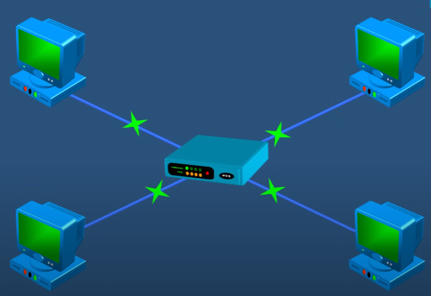
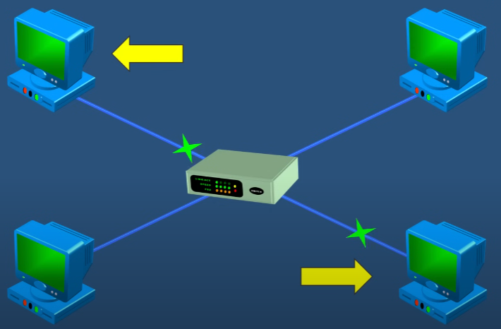
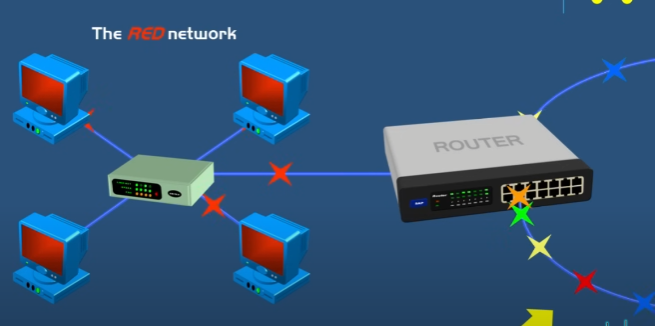

# 2.3 네트워크 기기

## 네트워크 기기의 종류

### Hub

- 한 인터넷 네트워크에 있는 기기들을 모두 연결하는 것이 목적
- 여러 포트로 이루어진 디바이스로 네트워크 디바이스들로부터 이더넷 연결이 가능
- 데이터를 필터링 하거나 지능적으로 골라내는 능력이 없음
- 단순히 연결된 기기 내의 모든 데이터를 복사 및 전송
- Hub는 디바이스가 언제 연결되었는지에 대한 정보 밖에 없음
- 데이터 전송을 의도한 디바이스가 아니어도 전송이 되어 비효율적이고 보안 문제가 발생할 수 있음

### Switch

- Hub와 비슷한 기능을 하지만 한 Switch에 연결된 모든 디바이스들의 물리적 주소(MAC Address) 정보를 저장
- 데이터를 전송하고자 하는 디바이스에만 전송 가능하기 때문에 효율적

### Router

- 네트워크의 Gate Way
- IP 주소를 기반으로 데이터를 route and forward
- Router 처리 순서
  1. Data Packet 수신
  2. IP 주소 검사
  3. IP 주소가 동일하면 데이터 Receive
  4. IP 주소가 다르다면 다른 네트워크로 전송
- IP 주소 기반이기 때문에 의도한 외부 네트워크로만 데이터 전송 가능

### Comparison

| 기기종류 | 범위 | 목적지               |
| -------- | ---- | -------------------- |
| Hub      | 내부 | 연결된 모든 디바이스 |
| Switch   | 내부 | 타겟 디바이스        |
| Router   | 외부 | 타겟 IP              |

## 스위치 종류

스위치의 상위계층(L7이 최상위)은 하위계층의 기능을 포함

1. L1 스위치

- 허브, 더미허브
- 랜선에 꽂혀있는 모든 포트에 데이터를 전달

2. L2 스위치

- 스위칭 허브
- MAC 주소를 찾아서 전달
- 장점: 구조가 간단하며 신뢰성이 높음, 가격이 저렴하고 성능이 좋음
- 단점: packet에 의해 성능 저하 발생, 라우팅 불가능

3. L3 스위치

- 라우터(순수 라우터), 공유기
- 네트워크 packet을 연결해주는 통로 역할, 대역폭 확장이 주 기능
- L3 스위치 = L2 스위치 + L3 라우팅 기능 (MAC 주소 + IP 주소)
- 공유기와 L3 스위치의 차이
  - 공유기: 가정용
  - L3 스위치: 기업용 (가격, 성능 ↑)

4. L4 스위치

- 외부에서 들어오는 모든 요청은 서버가 아닌 L4 스위치를 거침
- L4 스위치가 먼저 요청을 받은 후 서버들에게 분배
- 부하분산(로드밸런싱)이 주 기능
- 두 개 이상의 서버를 사용할 때 하나의 서버로 과부하가 오지 않도록 분산하는 기능
- 서비스가 중단되는 경우에 대비하기 위한 목적도 있음

5. L7 스위치

- 어플리케이션 영역
- L4와 L7 모두 일반적으로 서버들의 부하분산을 위해 사용
- 차이점
  - L4
    - OSI Layer 3~4에 속하는 IP 주소 및 TCP/UDP 포트 정보를 보고 스위칭
    - TCP/UDP 포트 이용하여 트래픽 분산처리
  - L7
    - OSI Layer 3~7에 속하는 IP 주소, TCP/UDP 포트 정보 및 packet 내용까지 모두 보고 스위칭
    - L4에 비해 OSI 7 LAYER의 HTTP의 URL, FTP 쿠키 정보 및 바이러스 패턴을 분석하여 보안에 더 유리하고 정교한 로드밸런싱이 가능 (Traffic filter, Security, VPN 가능)
- 보안 스위치
- 데이터 분석을 통해 DDoS 공격 방어, 감염 패킷 필터링 등의 기능을 제공

## 네트워크 기기의 처리 범위

| 계층              | 기기              |
| ----------------- | ----------------- |
| 애플리케이션 계층 | L7 스위치         |
| 인터넷 계층       | 라우터, L3 스위치 |
| 데이터 링크 계층  | L2 스위치, 브리지 |
| 물리 계층         | NIC, 리피터, AP   |

### 브리지

- 두 개의 근거리 통신망(LAN)을 상호 접속할 수 있도록 하는 통신망 연결 장치
- 포트와 포트 사이의 다리 역할
- MAC 주소 관리
- 통신망 범위를 확장하고 서로 다른 LAN 등으로 이루어진 '하나의' 통신망을 구축할 때 사용

### NIC

- LAN 카드, 네트워크 인터페이스 카드(Network Interface Card)
- 두 대 이상의 컴퓨터 네트워크를 구성하는 데 사용
- 네트워크와 빠른 속도로 데이터를 송수신할 수 있도록 컴퓨터 내에 설치하는 확장 카드
- 각 LAN 카드에는 고유의 식별번호인 MAC 주소 존재

### 리피터

- 들어오는 약해진 신호 정도를 증폭하여 다른 쪽으로 전달하는 장치
- 광케이블이 보급됨에 따라 현재는 잘 쓰이지 않음

### AP

- Access Point
- packet을 복사하는 기기
- AP에 유선 LAN을 연결한 후 다른 장치에서 무선 LAN 기술(와이파이 등)을 사용하여 무선 네트워크를 연결 가능

참조: [PowerCert Animated Videos](https://youtu.be/1z0ULvg_pW8?si=QvWd4WE_nx5Fl9pN)
